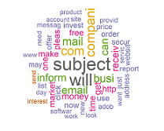

## [Text Analytics Dashboard](https://smotrova.github.io/R-Flexdashboard-TextAnalytics/)

This small self-educational project is devoted to applications of several possible classifiers that might be use to predict Spam/Not Spam emails. Models details and performances are presented on a [dashboard](https://smotrova.github.io/R-Flexdashboard-TextAnalytics/). The dashboard covers

* Data Description
* Bag of Words
* Logistic Regression
* Classification Tree
* Random Forest
* Support Vector Machines
* Models' Preformances on Training and Test Datasets
